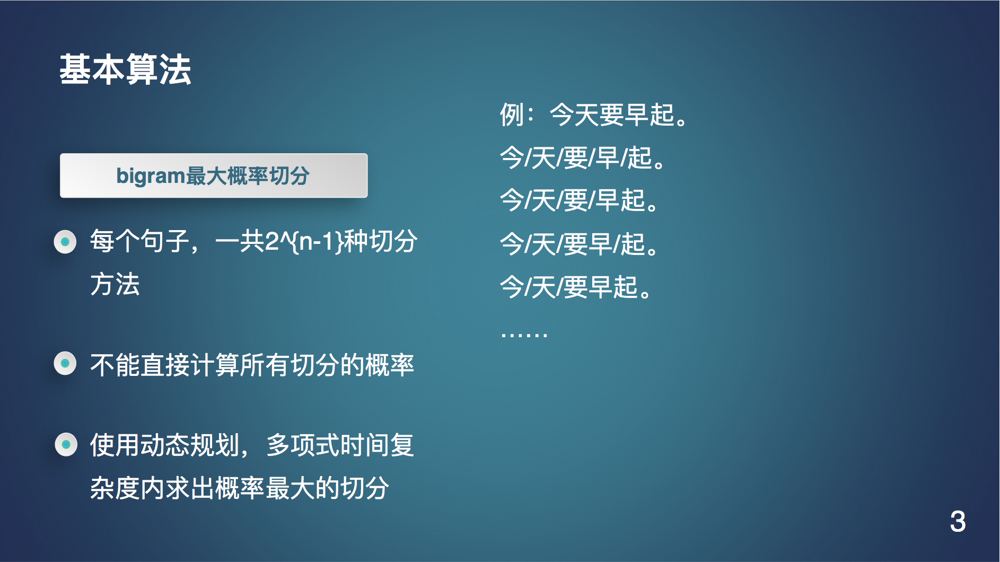
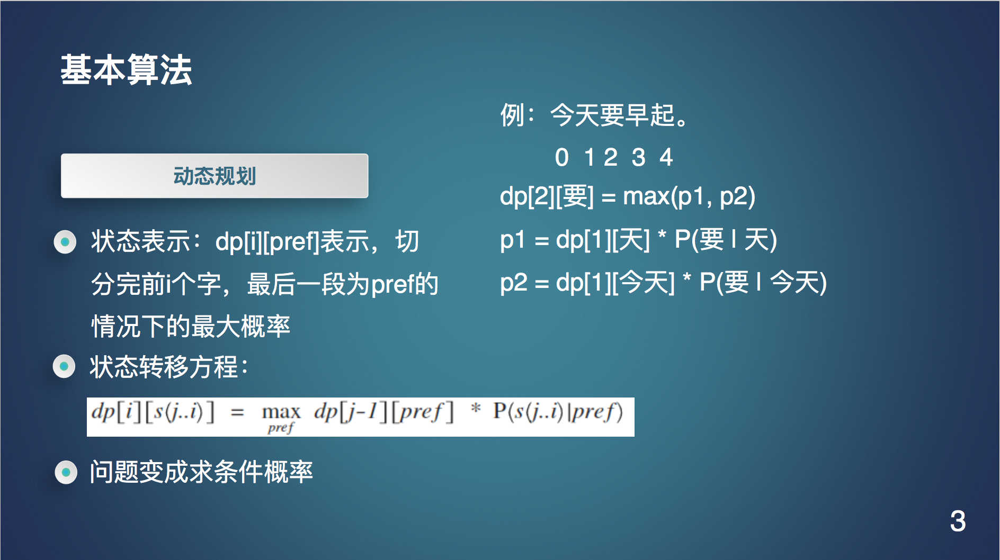
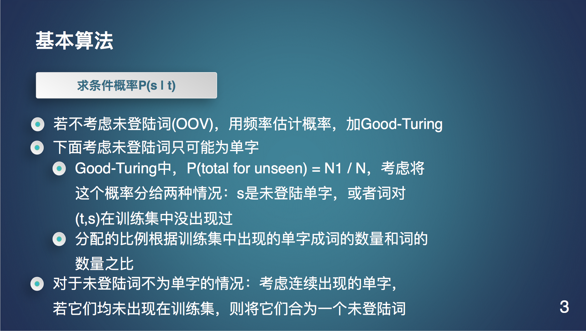

# 算法设计
* 在HMM下的最大概率分词，使用并对Good-Turing平滑略作改动，增加了处理OOV的能力。
* 具体如下：

# 实验结果
* 使用的数据集为部分1998人民日报的切分语料，一共5257个句子。
* 80%训练集，20%测试集
* 准确率88%，召回率94%，F值91%

# 代码
* separate.py 处理训练预料，将处理结果喂给SimpleNgram.py
