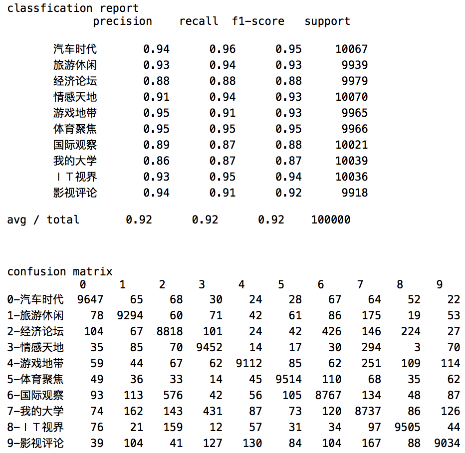
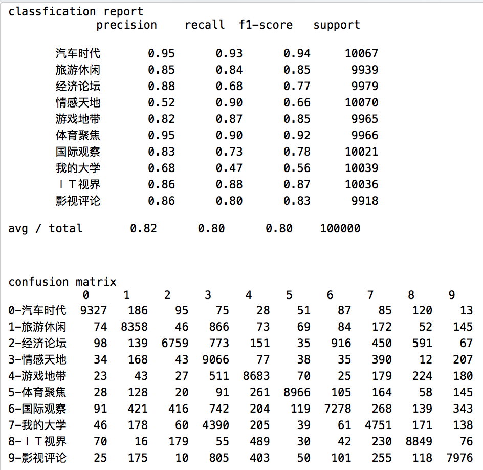
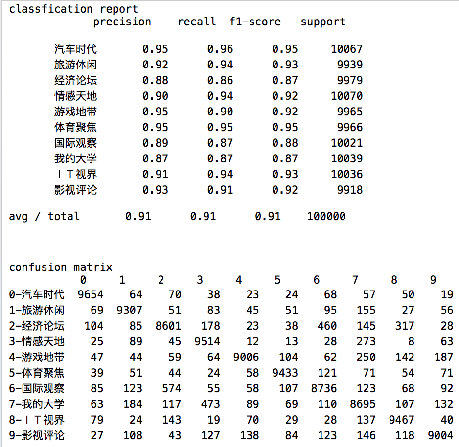

# 文本分类程序
* 从天涯论坛、财经网爬取10类，每类20000篇文本，预测数据、训练数据各50%。
* 特征处理方法如下：
    * 去除数字、空格后用jieba分词，去除停用词。
    * 对tf-idf用卡方检验，筛选出5000维特征。
    * 用LDA提取每个样本在20个主题上的分布。
    * GBDT对以上特征挖掘组合特征，合并得到最终特征，共7202维。
* 分别使用朴素贝叶斯、逻辑回归、线性SVM进行分类，最高准确率92%
    * SVM：
    * NB：
    * LR：
